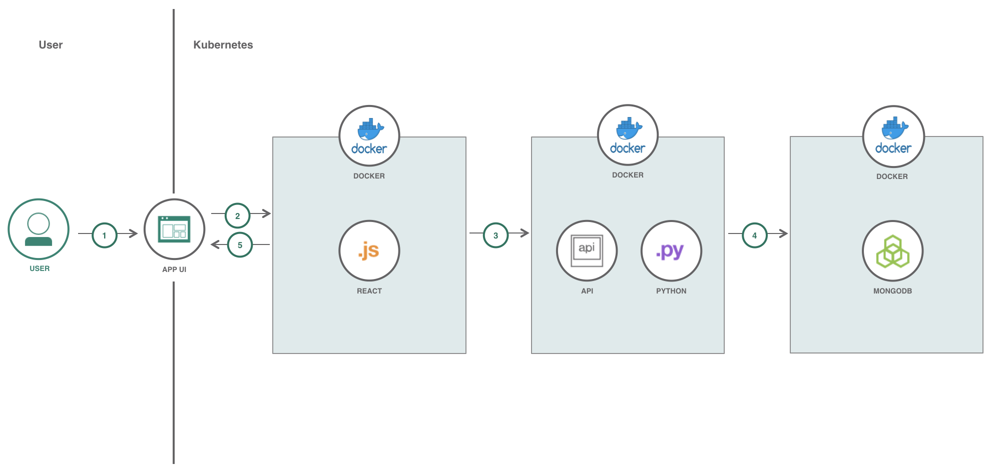

The README for a Code Pattern is very prescriptive, use the following template to get you started.

<!--Put badges at the very top -->
<!--change the repo -->
[](https://travis-ci.org/IBM/watson-banking-chatbot)

# Work Log
In this Code Pattern, we will create a Work Log web application using Flask, Mongo, and Kubernetes. The Work Log application is used to keep track of and log different types of days that are associated with work. The different types of days include:

* Working in the office
* Working remotely
* Vacation days
* Holidays
* Sick days

When the reader has completed this Code Pattern, they will understand how to:

* Create a Python Flask application
* Incorporate Mongo into a Python application
* Deploy and run a Docker container on Kubernetes




## Architecture

1. User interacts with the App UI to initially create an account, login to account, or reset password for their account. Once User is logged in, they can view, add, and edit their work log data.
2. All these actions are controlled through API calls by the application using API Connect.
3. API Connect links the connected API calls to Kubernetes where the actual APIs and application are hosted.
4. The API calls are processed in the Flask application in the Docker container on Kubernetes and are handled accordingly.
5. The data is stored, gathered, and/or modified depending on the API calls.
6. The response from the API calls are handled accordingly be the App UI.

<!--Update this section-->
## Included components
Select components from [here](https://github.ibm.com/developer-journeys/journey-docs/tree/master/_content/dev#components), copy and paste the raw text for ease
* [Component](link): description
* [Component](link): description

<!--Update this section-->
## Featured technologies
Select components from [here](https://github.ibm.com/developer-journeys/journey-docs/tree/master/_content/dev#technologies), copy and paste the raw text for ease
* [Technology](link): description
* [Technology](link): description

# Steps
Use the ``Deploy to IBM Cloud`` button **OR** create the services and run locally.

## Deploy to IBM Cloud
<!--Update the repo and tracking id-->
[](https://bluemix.net/deploy?repository=https://github.com/IBM/watson-banking-chatbot.git)

1. Press the above ``Deploy to IBM Cloud`` button and then click on ``Deploy``.

<!--optional step-->
2. In Toolchains, click on Delivery Pipeline to watch while the app is deployed. Once deployed, the app can be viewed by clicking 'View app'.


<!--update with service names from manifest.yml-->
3. To see the app and services created and configured for this Code Pattern, use the IBM Cloud dashboard. The app is named `watson-banking-chatbot` with a unique suffix. The following services are created and easily identified by the `wbc-` prefix:
    * wbc-conversation-service
    * wbc-discovery-service
    * wbc-natural-language-understanding-service
    * wbc-tone-analyzer-service

## Run the Application Locally
Follow these steps to setup and run this code pattern locally. The steps are described in detail below.

### Prerequisite

* [Python 3.7](https://www.python.org/downloads/release/python-370/) (Required if not running application in Docker container)
* [Python Libraries](requirements.txt) Use `pip3.7 install` (Required if not running application in Docker container)
* [Docker](https://www.docker.com/products/docker-desktop)

<!-- there are MANY updates necessary here, just screenshots where appropriate -->

1. [Clone the repo](#1-clone-the-repo)
2a. [Run the application in Docker container](#2a-run-the-application-in-docker-container)
2b. [Run the application not in Docker container](#2a-run-the-application-not-in-docker-container)

### 1. Clone the repo

Clone the `worklog` locally. In a terminal, run:

```
$ git clone https://github.com/IBM/worklog
```

### 2a. Run the application in Docker container
1. Start the application by running `docker-compose up --build` in the `/worklog` directory.
2. Once the containers are created and the application is running, use the [Swagger](http://localhost:5000/api/) and [API.md](API.md) for instructions on how to use the APIs.

### 2b. Run the application not in Docker container
1. Comment out the `web` service in [docker-compose.yml](docker-compose.yml).
2. Change the `MongoClient` host in [utils.py](app/services/utils.py) from `mongo` to `localhost`.
3. Start the Mongo container by running `docker-compose up --build` in the `/worklog` directory.
4. Start the application by running `python3.7 -m app.__init__` in the `/worklog` directory.

<!--Include any troubleshooting tips (driver issues, etc)-->

# Troubleshooting

* Error: Environment {GUID} is still not active, retry once status is active

  > This is common during the first run. The app tries to start before the Discovery
environment is fully created. Allow a minute or two to pass. The environment should
be usable on restart. If you used `Deploy to IBM Cloud` the restart should be automatic.

* Error: Only one free environent is allowed per organization

  > To work with a free trial, a small free Discovery environment is created. If you already have
a Discovery environment, this will fail. If you are not using Discovery, check for an old
service thay you may want to delete. Otherwise use the .env DISCOVERY_ENVIRONMENT_ID to tell
the app which environment you want it to use. A collection will be created in this environment
using the default configuration.

<!--Include any relevant links-->

# Links
* [Demo on Youtube](https://www.youtube.com/watch?v=Jxi7U7VOMYg)
* [Watson Node.js SDK](https://github.com/watson-developer-cloud/node-sdk)
* [Relevancy Training Demo Video](https://www.youtube.com/watch?v=8BiuQKPQZJk)
* [Relevancy Training Demo Notebook](https://github.com/akmnua/relevancy_passage_bww)

<!-- pick the relevant ones from below -->
# Learn more

* **Artificial Intelligence Code Patterns**: Enjoyed this Code Pattern? Check out our other [AI Code Patterns](https://developer.ibm.com/code/technologies/artificial-intelligence/).
* **Data Analytics Code Patterns**: Enjoyed this Code Pattern? Check out our other [Data Analytics Code Patterns](https://developer.ibm.com/code/technologies/data-science/)
* **AI and Data Code Pattern Playlist**: Bookmark our [playlist](https://www.youtube.com/playlist?list=PLzUbsvIyrNfknNewObx5N7uGZ5FKH0Fde) with all of our Code Pattern videos
* **With Watson**: Want to take your Watson app to the next level? Looking to utilize Watson Brand assets? [Join the With Watson program](https://www.ibm.com/watson/with-watson/) to leverage exclusive brand, marketing, and tech resources to amplify and accelerate your Watson embedded commercial solution.
* **Data Science Experience**: Master the art of data science with IBM's [Data Science Experience](https://datascience.ibm.com/)
* **PowerAI**: Get started or get scaling, faster, with a software distribution for machine learning running on the Enterprise Platform for AI: [IBM Power Systems](https://www.ibm.com/ms-en/marketplace/deep-learning-platform)
* **Spark on IBM Cloud**: Need a Spark cluster? Create up to 30 Spark executors on IBM Cloud with our [Spark service](https://console.bluemix.net/catalog/services/apache-spark)
* **Kubernetes on IBM Cloud**: Deliver your apps with the combined the power of [Kubernetes and Docker on IBM Cloud](https://www.ibm.com/cloud-computing/bluemix/containers)

<!--keep this-->

# License
[Apache 2.0](LICENSE)
