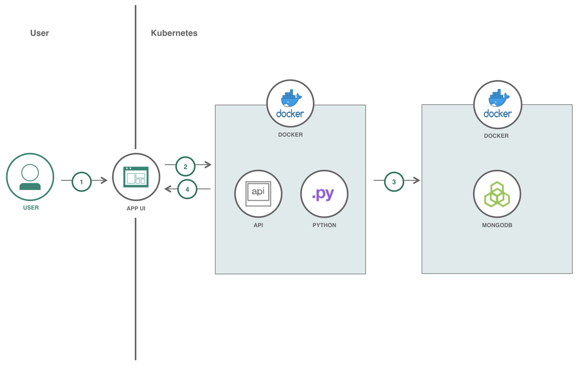

# Short Name

Deploy Python Flask application in Kubernetes.

# Short Description

Log and view different types of work days in a database with API calls.

# Offering Type

Cloud

# Summary

This code pattern creates a Python Flask application that incorporates MongoDB as microservices in Docker containers. These containers are deployed in Kubernetes.

# Author

Max Shapiro

# Code

* https://github.com/IBM/worklog

# Description

In this Code Pattern, we will create a Work Log web application using Flask, MongoDB, and Kubernetes. The Work Log application is used to keep track of and log different types of days that are associated with work. The different types of days include:

* Working in the office
* Working remotely
* Vacation days
* Holidays
* Sick days

When the reader has completed this Code Pattern, they will understand how to:

* Create a Python Flask application
* Incorporate MongoDB into a Python application
* Deploy and run microservices on Kubernetes

# Flow

1. User interacts with the App UI to initially create an account, login to account, or reset password for their account. Once User is logged in, they can view, add, and edit their work log data.
2. The functionality of the App UI that the User interacts with is handled by React. React is where the API calls are initialized.
3. The API calls are processed in the Flask API microservice on Kubernetes and are handled accordingly.
4. The data is stored, gathered, and/or modified in MongoDB depending on the API calls.
5. The response from the API calls are handled accordingly be the App UI.

# Included components

* [IBM Cloud Container Service](https://console.bluemix.net/docs/containers/container_index.html):  IBM Bluemix Container Service manages highly available apps inside Docker containers and Kubernetes clusters on the IBM Cloud.
* [Swagger](https://swagger.io/): A framework of API developer tools for the OpenAPI Specification that enables development across the entire API lifecycle.

# Featured technologies

* [Container Orchestration](https://www.ibm.com/cloud-computing/bluemix/containers): Automating the deployment, scaling and management of containerized applications.
* [Microservices](https://www.ibm.com/developerworks/community/blogs/5things/entry/5_things_to_know_about_microservices?lang=en): Collection of fine-grained, loosely coupled services using a lightweight protocol to provide building blocks in modern application composition in the cloud.
* [Python](https://www.python.org/): Python is a programming language that lets you work more quickly and integrate your systems more effectively.
* [Flask](http://flask.pocoo.org/): A microframework for Python for building APIs.
* [React](https://facebook.github.io/react/): JavaScript library for building User Interfaces.
* [MongoDB](https://www.mongodb.com/): A document NoSQL database.

# Blog

## My Journey to Creating my First Web Application

## Max Shapiro

## The original intention of this application was to be a personal work log for myself to log total days worked, days worked remotely, vacation days used, and holidays used. This was a command line Python application that saved data to a CSV file.

When the thought was brought up that this application could be modified and scaled to work on the cloud as a web application and with the guide of my manager, I began researching and planning how I could make this a reality. 

Because this application was to be moved to the cloud, I decided that I would use Docker to containerize the application. As a result, I also started to learn and understand Kubernetes. However, as a starting point, I wanted to get a working version of my application locally without Docker containers before converting the application over.

Since this application already had a foundation with Python, I wanted to build on top of that with web based API management. I turned to Flask and began researching and understanding how it works and how I could make it work with my command line application. 

As I took parts of my existing application and started to convert it to be used with Flask, I started asking some questions:

1. Using CSV to store data is not appropriate on the cloud, how will I store data on the cloud?
2. What API endpoints should I create? How should a user be able to interact with this application?

With these questions in hand, I decided to meet with my manager to get another opinion and see what insight he could offer.

For data storage, my manager suggested I look into Cloudant, MongoDB, and MySQL and see which would be best for what I was trying to achieve. From my research, I did not find anything that showed Cloudant was supported by Python. So I removed Cloudant from the running. With it down to MongoDB and MySQL it was now basically down to whether a relational database was something that was necessary for this application. As I reviewed the data I wanted to store, I came to the remote days worked data. The way I stored the data in the CSV file was including the total days worked remotely as well as each location and the number of days worked remotely in each location. Since the locations would be different for different users, there was no way I could come up with a schema in a relational database to handle all locations appropriately. This is where I saw the value and flexibility of a non-relational database. With that, I decided to use MongoDB. And with no prior experience using MongoDB, I began my research into learning how to use and incorporate it with my application.

I know how I personally use this application, but I asked myself how other users may potentially use this application. I began to write an API.md file that outlined the API endpoints my application would have and the responses from these API calls. After thinking about other potential use cases, I decided to include office days worked and sick days used. All of the endpoints were for one user to interact with the application, similarly to how I use the application. When I showed my manager my progress, he suggested that I expand and scale the application to be used my multiple users. Where an instance of the application could be used by our team and have more value as a cloud based application. I then went back and reviewed my application, database structure, and API.md file and tried to see how I could expand and scale what I have worked on to include this capability. I then ran into the question of: each user should only be able to access data associated with themselves, how can I make the application secure and capable of acheiving this?

In order for users to be able to only have access to their respective data, I decided that users should have accounts that they would need to login to. To acheive this, I created another database with user account information and updated the API.md file with how I wanted to modify the application to handle this. I then began researching how I could incorporate logging in and user sessions. I first looked into sessions from Flask. I ran into some blockers with getting sessions to hold user data so the program would know the user was logged in. I then switched gears and decided that I would incorporate session info in MongoDB which ended up working as intended. With the application now having the capability to handle multiple users, a new question now came to light: I can easily create new users in MongoDB, how can I easily allow others to create new users?

I realized that I have the luxury of just creating new users myself in MongoDB, but actual users of this cloud based application won't have this luxury. In fact, when an instance of this application is created, there won't be any users at all. I started thinking about how to handle the initializing of this application and how to handle the onboarding of new users. I decided on creating an endpoint to allow for creating new users.

Once I finished the user end points, I thought it was important to add a layer of security by encrypting the passwords when storing them in the database. After including this layer and I was satisfied with the application for the time being, I started the process of moving the application to Docker containers and Kubernetes. 

After successfully containerizing the application in Docker, adding the containers to Kubernetes, and moving the application to IBM Cloud, I finally had my local application running on the cloud. It was definitely a rewarding feeling making successful API calls to the cloud. Now that I had a working version of my application on the cloud, I started asking myself questions about next steps:

1. Now that this application is running successfully, how should I test this application? What kind of a test bed should I create?
2. How can I improve this application? What new features should I add?
3. This application currently returns JSON objects, what kind of a web GUI should I build on top of this?

For testing this application, I decided on creating python unit tests where I would be testing each API end point. I wanted to make the test bed automated too and began my research on how to make this a reality. Eventually, I was able to automate the initilaizing of a test client for the Flask application and a Docker container for the Mongo database. I then had a working automated test bed.

Once I had my application and test bed where I wanted them, I showed what I had to several people who provided feedback and gave suggestions on how I could improve my application. One suggestion in particular stood out and made the biggest impact on my work for the forseeable future. The suggestion was to reorganize the application file structure where the files would each have their own "microservice" rather than how I had it at the moment which was all in one main file. This suggestion made sense, because typically applcations are not just in one file and are spread out. Doing this also makes the code less intimidating and easier to follow and understand. In addition to making the application easier to understand, I also included a swagger file for those who use this application to know how the APIs are supposed to work.

Once my restructuring was completed and the application was running where it was supposed to be, I then started my preperation and designing of the GUI. I wanted to implement design thinking principles into the process of creating the GUI. I went to my manager to help me with this process for a couple reasons: He has more experience than me with UI/UX designing and it was important to me to get someone else's opinion and perspective on the UI and functionality of the application. During our design thinking sessions, it was becoming apparent to both of us that there was so much potential and so many directions we could take this applicatiion in. However, at the end of the day, we both realized that we needed to focus on the original goal which was to get a working GUI for the existing functionality. As a result, we then desiged wireframes for the GUI.

With the wireframes completed, I could start bringing these wireframes to life. I started researching different Javascript frameworks that I could use to create this GUI. I compared Angular, React, and Vue. I ultimately decided on using React, because it is popluar in the industry and seemed straightforward to learn. Once I learned React and finished the GUI, I deployed it alongside my backend application on the IBM Cloud.

With all parts of the application now successfully running on the IBM Cloud, I began wrapping up my work on this application and reflecting on my time working on this application. Throughout this process I not only had to learn how to use Flask, Mongo, Kubernetes, React, and other various componenets of how to make and structure an application, but also how to use all of these working together. This was definitely a rewarding experience and I hope you enjoyed reading this and using this application!

# Links

* [Flask](http://flask.pocoo.org/)
* [Swagger Editor](https://editor.swagger.io/)
